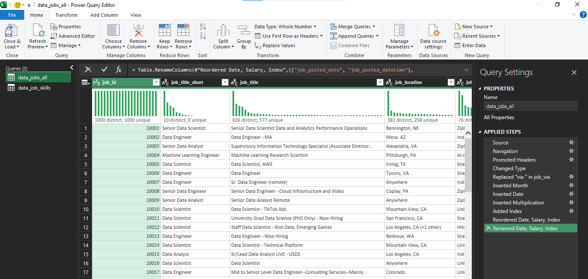
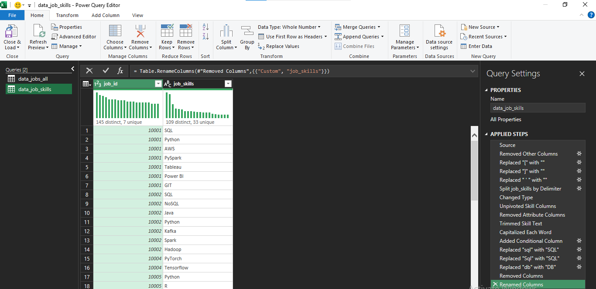
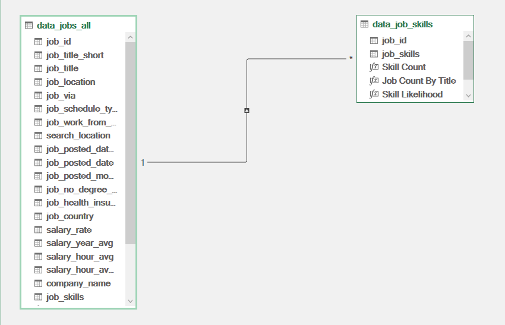
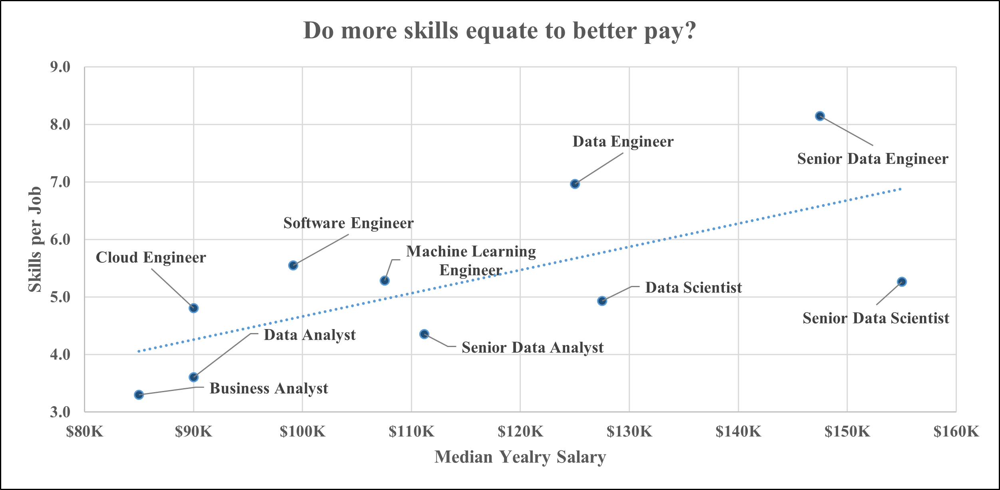
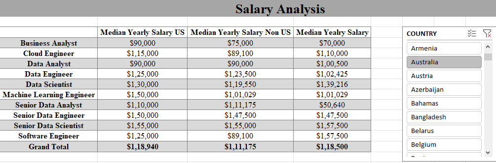
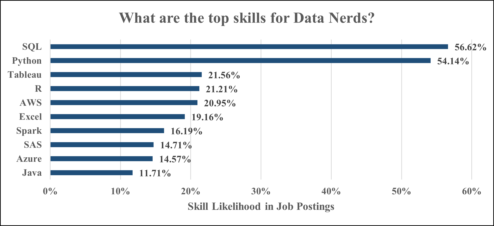
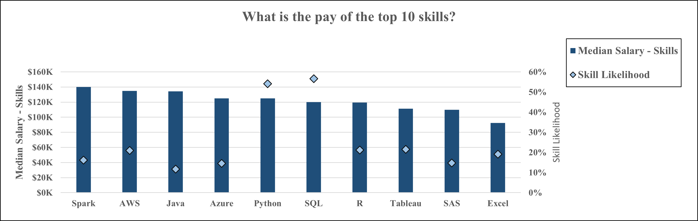

# 📊 Data Jobs Market Intelligence Dashboard

## Overview

The Data Jobs Market Intelligence Dashboard is an end-to-end Business Intelligence project built in Microsoft Excel to analyze salary trends, skill demand, and compensation patterns across data-related careers.

The project leverages Power Query for ETL and data transformation, Power Pivot for relational data modeling, DAX for advanced calculations, and interactive dashboards for business insights.

This project demonstrates the complete BI workflow from raw data preparation to actionable business insights.

---

## 🎯 Business Problem

The data job market is highly competitive and continuously evolving. Professionals often face challenges in identifying:

- Which data roles offer the highest salaries
- Which technical skills are most in demand
- Which skills command premium compensation
- Whether acquiring more skills leads to better pay
- How salaries vary across job titles and countries

This dashboard addresses these questions through data-driven analysis of job posting data.

---

## 🛠️ Tools & Technologies

| Category | Technology |
|-----------|------------|
| Data Cleaning | Power Query |
| Data Modeling | Power Pivot |
| Calculations | DAX |
| Dashboarding | Microsoft Excel |
| Visualization | Pivot Charts |
| Interactive Filtering | Slicers |
| Analysis | Pivot Tables |

---

# 🔄 Project Workflow

```text
Raw Job Posting Dataset
            │
            ▼
     Power Query ETL
            │
            ▼
      Data Modeling
      (Power Pivot)
            │
            ▼
       DAX Measures
            │
            ▼
 Interactive Dashboard
            │
            ▼
      Business Insights
```

---

# 📥 Data Preparation & ETL

The raw dataset required extensive transformation before analysis.

### Transformations Performed

- Promoted Headers
- Corrected Data Types
- Renamed Columns
- Created Date Fields
- Created Month Fields
- Added Index Column
- Removed Unnecessary Columns
- Standardized Skill Names
- Cleaned Text Fields
- Created Reference Tables
- Prepared Data for Modeling

---

## Power Query Workflow

### Power Query - Jobs Dataset



**Highlights**
- Cleaned and transformed the primary jobs dataset
- Created additional date fields for reporting
- Optimized data structure for analysis

---

### Power Query - Skills Dataset



**Highlights**
- Split multi-value skill fields
- Unpivoted skill columns
- Standardized skill naming conventions
- Built a normalized skills table for analysis

---

# 🧩 Data Modeling

A relational data model was created using Power Pivot.

### Model Structure

| Table | Description |
|---------|------------|
| data_jobs_all | Main jobs dataset containing salary and job information |
| data_job_skills | Normalized skill dataset containing one record per skill |

### Relationship Design

A one-to-many relationship was established using **Job ID**.

```text
data_jobs_all (1)
        │
        │ Job ID
        ▼
data_job_skills (*)
```

This model enables:

- Cross-table filtering
- Skill-level analysis
- Dynamic aggregations
- Better scalability and maintainability

---

## Power Pivot Data Model



---

## 📐 DAX Measures

The dashboard leverages custom DAX measures to enable dynamic calculations and interactive reporting.

| Measure | Purpose |
|----------|----------|
| Skill Count | Counts skill occurrences within the selected context |
| Job Count | Counts job postings within the selected context |
| Skills per Job | Calculates the average number of skills required per posting |
| Median Yearly Salary | Computes the median annual salary across all jobs |
| Median Yearly Salary (US) | Computes the median annual salary for US-based jobs |
| Median Yearly Salary (Non-US) | Computes the median annual salary for jobs outside the US |
| Median Salary by Skill | Calculates the median salary associated with a specific skill |
| Skill Likelihood (%) | Measures how frequently a skill appears in job postings |

---

# 📊 Dashboard Analysis

---

## 📊 Salary vs Skills Analysis

### Business Question
Do more skills equate to better pay?



### Key Findings

- Senior Data Engineer roles command the highest salaries while requiring the largest number of skills.
- Data Engineering positions generally require broader technical skillsets than analyst-focused roles.
- Business Analyst and Data Analyst positions require fewer skills and have lower median salaries.
- The positive trendline suggests a relationship between skill breadth and compensation.

### Insight

While acquiring additional skills generally increases earning potential, specialized expertise in high-value domains such as Data Engineering and Data Science appears to have a greater impact on compensation than skill quantity alone.

---

## 💰 Salary Analysis

### Business Question
How do salaries vary across job titles and regions?



### Key Findings

- Senior Data Scientist and Senior Data Engineer roles offer the highest median salaries.
- Machine Learning Engineers and Data Scientists consistently rank among the top-paying positions.
- US-based salaries are generally higher than salaries outside the United States.
- Salary differences are particularly noticeable in highly technical roles.

### Insight

Experience level, technical specialization, and geographic location are major drivers of compensation within the data industry.

---

## 🧠 Skill Job Analysis

### Business Question
Which skills are most frequently requested in data job postings?



### Key Findings

- SQL is the most requested skill, appearing in over 56% of job postings.
- Python closely follows SQL and is required in more than half of all postings.
- Tableau, R, and AWS remain highly sought-after skills.
- Excel continues to maintain strong relevance despite the growth of modern analytics tools.

### Insight

Employers continue to prioritize strong SQL and Python foundations, while cloud and visualization technologies remain important differentiators in the job market.

---

## 💵 Skill Salary Analysis

### Business Question
Which skills are associated with the highest salaries?



### Key Findings

- Spark is associated with the highest median salary among the analyzed skills.
- AWS, Java, Azure, and Python also command premium compensation.
- SQL offers one of the strongest combinations of demand and salary.
- Excel remains valuable but is associated with lower median salaries compared to specialized technical skills.

### Insight

Specialized technologies such as Spark and cloud platforms often command higher salaries, while SQL and Python provide the best balance between market demand and earning potential.

---

# 💡 Key Findings

### Salary Insights

- Senior Data Scientist and Senior Data Engineer roles offer the highest median salaries.
- Compensation varies significantly by geography.
- Technical specialization generally leads to higher earnings.

### Skill Demand Insights

- SQL is the most requested skill in data-related jobs.
- Python remains one of the most valuable technical skills.
- Business intelligence tools continue to be highly relevant.

### Career Insights

- Combining technical and analytical skills improves employability.
- Professionals with broader skillsets generally command higher salaries.
- Demand remains strong across analytics, engineering, and data science roles.

---

# 🚀 Skills Demonstrated

### Data Engineering & Preparation

- Data Cleaning
- ETL Development
- Data Transformation
- Data Normalization

### Business Intelligence

- Power Query
- Power Pivot
- DAX
- Data Modeling
- Relationship Design
- Cardinality Management

### Analytics

- Exploratory Data Analysis
- Salary Analysis
- Skill Demand Analysis
- Workforce Analytics

### Visualization

- Dashboard Design
- Interactive Reporting
- KPI Development
- Data Storytelling

---

# 📂 Repository Structure

```text
Data_Jobs_Market_Intelligence_Dashboard/
│
├── README.md
├── Data_Jobs_Market_Intelligence_Dashboard.xlsx
│
├── images/
│   ├── power-query-jobs.png
│   ├── power-query-skills.png
│   ├── data-model.png
│   ├── salary-vs-skills.png
│   ├── salary-analysis.png
│   ├── skill-job-analysis.png
│   └── skill-salary-analysis.png
│
└── dataset/
    └── data_jobs.csv
```

# 📌 Conclusion

This project demonstrates a complete Business Intelligence workflow using Excel, Power Query, Power Pivot, and DAX to transform raw job posting data into actionable market insights.

The analysis revealed that:

- SQL and Python remain the most essential skills in the data job market.
- Specialized technologies such as Spark, AWS, and Azure command premium salaries.
- Senior-level engineering and data science roles offer the highest compensation.
- Broader technical skillsets generally correlate with higher earning potential.

By combining data cleaning, data modeling, DAX calculations, and dashboard development, this project showcases practical Business Intelligence techniques used to support data-driven career and workforce decisions.
